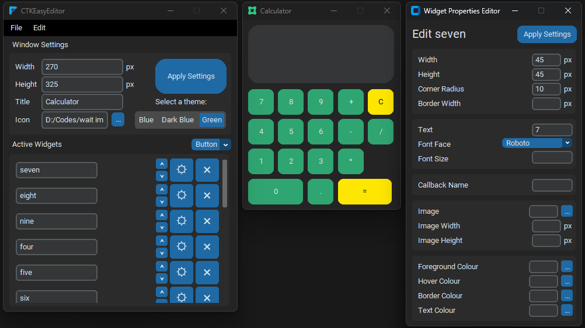

# CTKEasyEditor

An easy GUI editor for CustomTkinter in Python - think of it as a boilerplate generation tool for your CustomTkinter projects. Simply arrange elements, change their properties, and then export to a .py file ready to code in!

Thanks to Tom Schimansky for their CustomTkinter development. Find the original page for CustomTkinter here: https://customtkinter.tomschimansky.com/
The original documentation on CustomTkinter is excellent, and I recommend it for anyone starting off and struggling with the usage of this tool.
Also thanks to Akascapes for providing the CTkColorMenu widget and CTkMenuBar widget.

Note this is still a work in progress:

Zip and Installer should be the most recent stable release, the python scripts are the most recent experimental releases.

Files, Windows Only (I can't figure out how to freeze to mac format). Just click on links and then press download:

- [Download Installer](https://github.com/coding-beagle/CTKEasyEditor/blob/main/Files/installer-windows/CTkEasyEditor-1.4-win64.msi)

- [Download As Zip](https://github.com/coding-beagle/CTKEasyEditor/blob/main/Files/zip-windows/CTkEasyEditor.zip)

Other platforms must download and run python code yourself (I can't figure out cx_freeze):

[Advanced Install Instructions](documentation\install.md)

This tool is still in development, please report any bugs or issues under the issues tab.
Right now it seems to work okay, and the current implementation includes:

- **Latest Update**:
  - Added the ability to change widgets' parents on the fly.
  - Improved snapping capabilities even further
  - Made window dynamically resizable.

- Easy Application Window Settings Management
- Easy Active Widgets manager
- Dragging and snapping of widgets
- Widget Editing
- Use of Built In Themes for CTK
- Export to OOP and Procedural files
- Preference Handler (i.e. names of modules, root element, etc)
- Saving and opening of projects
- Change widgets' parents on the fly!

To be implemented soon:

- Custom Theme Support
- Some widgets don't play nice currently, namely CTkScrollableFrame, CTkTreeView and CTkSegmentedButton. I'll add these when I can get them to a stable version and playing nice.

Hotkeys & Shortcuts:

- CTRL --> Hold while dragging to prevent widget from snapping into place
- Shift --> Enforce Snapping on Grid / Center lines only
- ALT --> Only snap widget to other widgets, not the app center lines
- Double Click --> Opens editor window on that widget
- Right Click --> Opens context menu on widget (edit, duplicate, delete)

- The standard save, save as and open hotkeys, i.e. ctrl+s, ctrl+shift+s, ctrl+o, etc
- Control G --> Open the grid aligner
- Control + arrow keys --> Adjust the grid size
- Control R --> Toggle Window Size Adjustability

